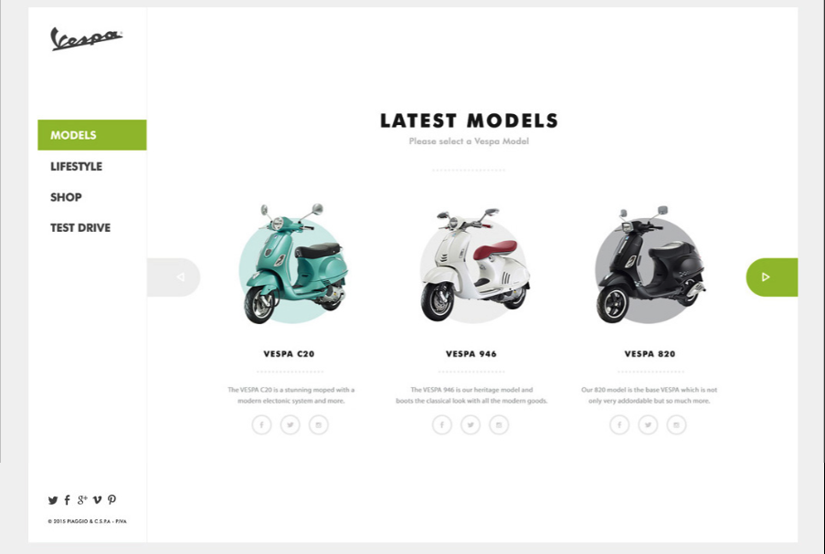

# Book Appointment Front End

This React front end project is a simple course app with basic functionalities and consists of consuming a Ruby on Rails back-end with JWT Bearer authentication.


For the learning purpose and to understand better what is going on under the hood; no packages is used e.g; O-AUTH, JWT for client side. Session storage is used to save token & login status.

Main functionalities are:

- Sign-up/Login/Logout users with dedicated endpoints
- Creating/Deleting courses with dedicated endpoints
- Listing courses with dedicated endpoints

## Design

Original design is belongs to: [Murat Korkmaz](https://www.behance.net/muratk).



## Built With

- Javascript
- React & Redux
- Redux Middleware (Thunk, Logger)
- Tailwind
- Jest for testing

## Live Demo

React Frontend : [Live Demo Link](https://warm-smakager-3f854a.netlify.app/)

Rails Backend : [Live Demo Link](https://afternoon-ravine-99760.herokuapp.com/api-docs/index.html)

Rails Backend : [Repository Link](https://github.com/yigitm/book-appointment/dev)

## Getting Started

If you wish to run this app in your local machine; please make sure that your Rails API is working on your browser localhost, within port:3000. You can find the instructions [HERE](https://github.com/yigitm/book-appointment/edit/API-readme/README.md).

Once your Rails API is running to get a local copy up of the React front end, run the following these steps.

### Prerequisites

If you are not familiar to use terminal, please check this [article](https://www.theodinproject.com/courses/web-development-101/lessons/command-line-basics-web-development-101)

### Setup

Open your terminal and run the following commands on your terminal.

Make sure 'Javascript' is not blocked in your browser.

### Install

To get a local copy of the repository, run the following commands on your terminal.

```
cd <your_desktop>
```

```
git clone https://github.com/yigitm/book-appointment-frontend
```

```
cd book-appointment-frontend
```

### Usage

To install the necessary Javascript packages to your project, run below commands.

```

npm install

```

To run the app, use below command.

```

npm run start

```

It will try to run the app in port 3000 and if you followed the settings to run your Rails API, this port should be occupied. And React server will prompt a message to run this app in a different port.

Check your terminal window and simply press enter to run the server in development mode and run the app in [http://localhost:3001](http://localhost:3001).To view it open your default browser.

### Run Tests

To run the tests, use below command.

```

npm run test

```

Launches the test runner in the interactive watch mode.\
See the section about [running tests](https://facebook.github.io/create-react-app/docs/running-tests) for more information.

## Author

👤 **Yigit Mersin**

- GitHub: [@github](https://github.com/ygtmrsn)
- LinkedIn: [@linkedIn](linkedin.com/in/yigitmersin)
- Twitter: [@twitter](https://twitter.com/ygtmrsn)

## 🤝 Contributing

Contributions, issues, and feature requests are welcome!

Feel free to check the [issues page](https://github.com/yigitm/book-appointment-frontend/issues).

## Show your support

Give a ⭐️ if you like this project!

## Acknowledgments

- [Microverse](https://www.microverse.org/)
- Behance: [Murat Korkmaz](https://www.behance.net/muratk).
- [Open Source](https://en.wikipedia.org/wiki/Open_source)

## 📝 License

This project is under [Creative Commons](https://creativecommons.org/licenses/by-nc/4.0/) and MIT licensed:

Copyright (c) 2012-2022 Microverse

Permission is hereby granted, free of charge, to any person obtaining
a copy of this software and associated documentation files (the
"Software"), to deal in the Software without restriction, including
without limitation the rights to use, copy, modify, merge, publish,
distribute, sublicense, and/or sell copies of the Software, and to
permit persons to whom the Software is furnished to do so, subject to
the following conditions:

The above copyright notice and this permission notice shall be
included in all copies or substantial portions of the Software.

THE SOFTWARE IS PROVIDED "AS IS", WITHOUT WARRANTY OF ANY KIND,
EXPRESS OR IMPLIED, INCLUDING BUT NOT LIMITED TO THE WARRANTIES OF
MERCHANTABILITY, FITNESS FOR A PARTICULAR PURPOSE AND
NONINFRINGEMENT. IN NO EVENT SHALL THE AUTHORS OR COPYRIGHT HOLDERS BE
LIABLE FOR ANY CLAIM, DAMAGES OR OTHER LIABILITY, WHETHER IN AN ACTION
OF CONTRACT, TORT OR OTHERWISE, ARISING FROM, OUT OF OR IN CONNECTION
WITH THE SOFTWARE OR THE USE OR OTHER DEALINGS IN THE SOFTWARE.
